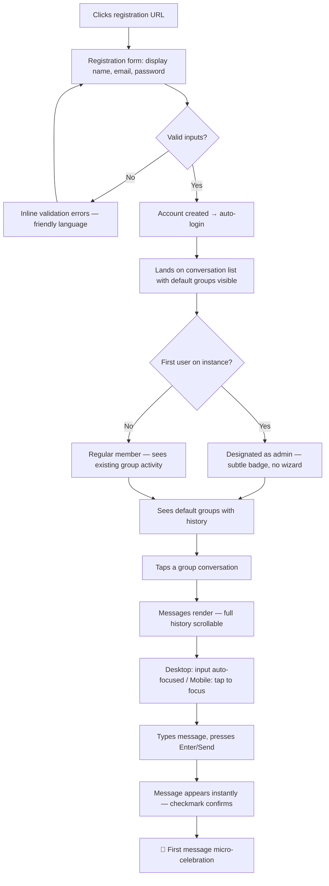
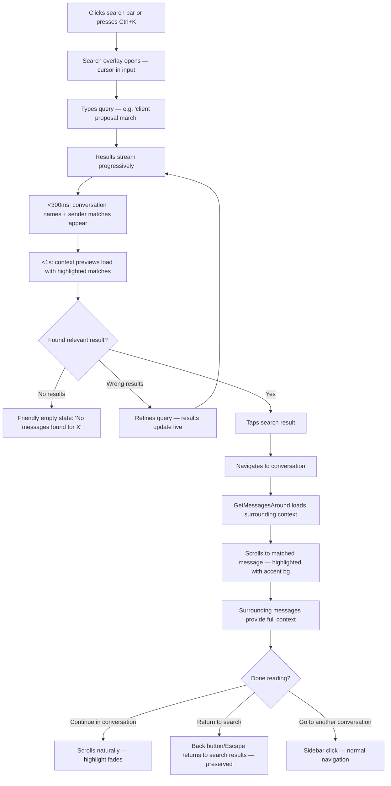
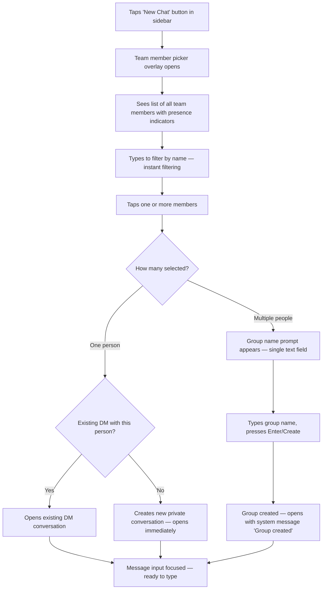
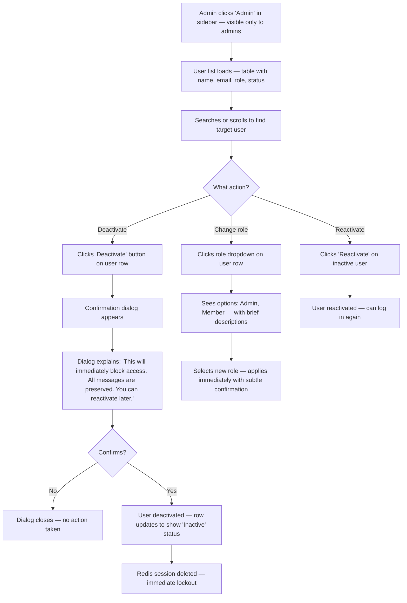
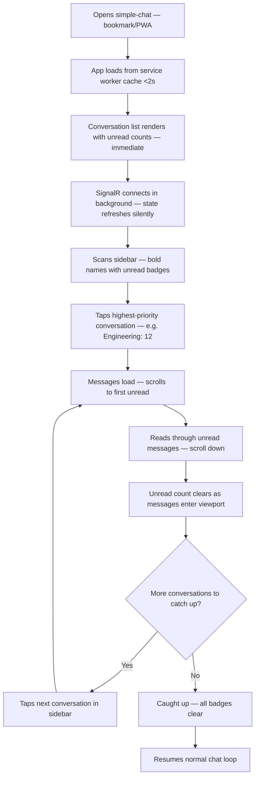

# UX Design Specification simple-chat

**Author:** Nabi
**Date:** 2026-03-28

---

## Table of Contents

- [Executive Summary](#executive-summary) — Vision, users, challenges, opportunities
- [Core User Experience](#core-user-experience) — Defining experience, platform, effortless interactions, success moments, principles
- [Desired Emotional Response](#desired-emotional-response) — Emotional goals, journey mapping, micro-emotions, design implications
- [UX Pattern Analysis & Inspiration](#ux-pattern-analysis--inspiration) — WhatsApp/Signal/Linear analysis, transferable patterns, anti-patterns
- [Design System Foundation](#design-system-foundation) — Custom SCSS tokens, component library, customization strategy
- [Defining Interaction](#defining-interaction) — One-liner, mental model, success criteria, experience mechanics, error handling
- [Visual Design Foundation](#visual-design-foundation) — Color system, typography, spacing, layout, accessibility
- [Design Direction Decision](#design-direction-decision) — Direction B selected, rationale, implementation tokens
- [User Journey Flows](#user-journey-flows) — Registration, search, new conversation, admin, Monday catch-up
- [Component Strategy](#component-strategy) — Component specifications, implementation build order
- [UX Consistency Patterns](#ux-consistency-patterns) — Buttons, feedback, forms, navigation, empty states, loading states
- [Responsive Design & Accessibility](#responsive-design--accessibility) — Breakpoints, WCAG compliance, keyboard nav, testing

## Executive Summary

### Project Vision

simple-chat's UX must embody the same radical simplicity that defines the product. The interface should feel **instantly familiar** — a warm, conversational tool that any team member can use without training, onboarding, or documentation. The design targets the least technical user persona (Sarah, a team lead with no DevOps background) as the baseline: if Sarah can do it without thinking, everyone else can too.

The primary design language is **WhatsApp's warmth and simplicity married with desktop chat ergonomics**. Users bring strong muscle memory from WhatsApp — conversation list, tap to open, type and send — but simple-chat's primary surface is a desktop browser with room for proper information density. The result: rounded, friendly, conversational aesthetics with a 3-panel layout that shows conversation previews, timestamps, and unread counts at a glance. Not WhatsApp Web's cramped compromise — a purpose-built desktop experience with WhatsApp's emotional quality.

Delight comes from speed and absence of friction, not from feature richness. "It feels instant" should be the first thing users notice.

### Target Users

**Primary design persona: Sarah (Non-technical Team Lead)**
- Tech comfort: Uses apps daily but doesn't configure or maintain them
- Expectation: "It should work like WhatsApp but for my team"
- Success moment: Searches for a 4-month-old message and finds it instantly
- Failure mode: Any screen that requires reading instructions or figuring out terminology

**Supporting personas inform edge cases:**
- **Marcus (.NET Dev):** Won't judge the UI — judges operational signals (logs, health endpoints). UX impact: status indicators and error states must be precise, not vague.
- **Alex (IT Admin):** Needs admin panel to be obvious and bounded. UX impact: admin functions clearly separated, no risk of accidental destructive actions. Deactivation requires confirmation.
- **Priya (New Member):** First impression matters — registration to first message must feel effortless. UX impact: registration is 3 fields (display name, email, password), channel discovery is immediate, history browsing is seamless.

### Key Design Challenges

1. **Desktop-first responsive design with WhatsApp-level warmth.** Desktop (3-panel: sidebar + chat + members), tablet (2-panel: collapsible sidebar + chat), and mobile (single-panel: list OR chat). The mobile experience must feel native-app quality via PWA — not a shrunken desktop view. Desktop must leverage its space for information density (preview text, timestamps, unread counts) while maintaining warmth. Transitions between panels must be fluid.

2. **Search as a primary feature, not a secondary utility.** Sarah switched from Slack because she lost message history. Search is her reason for being here. The experience should feel like Spotlight on Mac — fast, forgiving (fuzzy matching), and contextual. Results must show conversation name, sender, and surrounding text. Tapping a result must land in-conversation with the match highlighted and surrounding messages loaded (via `GetMessagesAround`), preserving context.

3. **Speed users can feel — three measurable UX moments.** (a) *Time to first value:* register to first message sent under 2 minutes (Docker deployment is ops time, not UX time). (b) *Message throughput:* input, send, see response — sub-200ms delivery with optimistic UI. Show message immediately with a "sending" indicator (WhatsApp single-checkmark pattern), confirm on persist-and-broadcast completion. The sending state is nearly invisible at <200ms but covers edge cases gracefully. (c) *Information retrieval:* search results under 1 second, context jump feels instant.

4. **Presence and notifications without anxiety.** Unread badges and online indicators must inform without creating pressure. Connection status indicator uses 3-second debounce before showing "Reconnecting..." to avoid flicker anxiety — but disconnected state shows immediately so users don't send into the void.

5. **Admin simplicity with safety.** Alex manages users infrequently. The 3 core operations (list users, assign roles, deactivate/reactivate) must be obvious and safe — deactivation requires explicit confirmation, role changes clearly explain what they mean.

### Design Opportunities

1. **"Zero-learning" onboarding.** By mirroring WhatsApp patterns, we eliminate traditional onboarding. No tooltips, no walkthroughs, no "getting started" guides. Registration is 3 fields. The first-run experience IS the regular experience — register, see conversations, start chatting.

2. **Warmth as differentiation — through tone, not just aesthetics.** Most self-hosted tools look utilitarian. simple-chat's warmth is expressed through: friendly visual design (rounded corners, soft palette, conversational typography), but more importantly through **microcopy and tone**. Empty states say "No messages yet — start a conversation!" not blank screens. Errors say "We lost connection, trying to reconnect..." not "WebSocket Error 1006." The product *speaks* like a helpful friend. Warmth also means **forgiveness** — graceful error recovery and gentle handling of edge cases.

3. **Accessibility as warmth.** WCAG 2.1 Level A isn't a compliance checklist — it's part of the brand. simple-chat is warm to *everyone*: screen reader users get ARIA live region announcements for incoming messages, keyboard-only users can navigate all core workflows, low-vision users get 4.5:1 contrast ratios. Inclusive design is how the product says "you belong here."

4. **Speed as a feature users feel.** Sub-200ms message delivery + skeleton screens + optimistic send (WhatsApp checkmark pattern) makes simple-chat feel faster than Slack. When "it feels instant" is the first thing users notice, that becomes word-of-mouth marketing.

## Core User Experience

### Defining Experience

The core experience of simple-chat is a **dual-mode conversation loop**: rapid real-time exchanges and asynchronous catch-up on missed messages. Neither mode is secondary — a team lead firing off quick replies and a new member scrolling back through yesterday's discussion are both primary use cases that must feel equally fluid.

**The core interaction:** Open simple-chat → see what's new (unread badges, bold conversation names) → tap into a conversation → read or reply → move on. This loop repeats dozens of times per day and must complete in under 2 seconds per cycle. The conversation list is the home screen, the message stream is the workspace, and switching between them must feel like turning a page — not loading a new application.

**What defines the product:** The absence of everything that isn't chat. No integrations panel, no app marketplace sidebar, no AI assistant floating button, no settings maze. The UI has exactly as many elements as the task requires and not one more. This is what "simplicity" means in practice — not fewer features, but fewer things competing for attention at any moment.

**Privacy as a felt experience:** Data sovereignty is a product feature, but it's also a UX quality. There are no tracking banners to dismiss, no cookie consent popups, no "share usage data?" prompts, no third-party embed warnings. The absence of privacy friction IS the privacy experience. Users feel safe because nothing ever asks them to compromise.

### Platform Strategy

**Primary platform:** Desktop web browser (Chrome, Firefox, Edge, Safari — latest 2 major versions). This is where teams spend their workday and where the 3-panel layout delivers maximum value.

**Secondary platform:** Mobile browser + PWA install. Teams check messages on the go, reply quickly, catch up during commutes. The single-panel mobile experience must feel native-app quality, not a responsive afterthought.

**Input model:** Desktop is keyboard-primary (type message, Enter to send, keyboard shortcuts for navigation). Mobile is touch-primary (tap conversations, swipe between panels, on-screen keyboard). Both must feel native to their input method — no touch targets too small for fingers on mobile, no keyboard traps on desktop.

**Offline/connectivity:** Users are primarily on stable office networks. Mobile PWA users may experience spotty connections. The design assumes online-first — no local message queuing or offline compose. Clear connection state indicator (connected/reconnecting/disconnected) keeps users informed. Reconnection is automatic and silent when brief (<3s debounce); persistent disconnection shows a non-intrusive but unmissable banner. **Critical: user input is never lost.** If a user types a message and sends during a disconnection, the message stays in the input field with a "Couldn't send — tap to retry" state. This is not offline queuing — it's input preservation. Losing a typed message is a trust-destroying moment.

### Effortless Interactions

These interactions must require zero conscious thought:

1. **Switching conversations.** Tap a conversation, instantly see messages. No loading spinners for recent conversations (cached in BehaviorSubject state). Scroll position per conversation is preserved — return to a conversation and you're where you left it.

2. **Sending a message.** Type, press Enter, done. Message appears instantly (optimistic UI with WhatsApp checkmark pattern). No mode selection, no formatting toolbar by default, no "are you sure?" — just text in, message out.

3. **Starting a new conversation.** Tap the new message button, see team members, tap a name — you're in a DM. Select multiple people and you're prompted for a group name. The user picks people, not conversation types. The system infers Private vs. Group from the selection. No "create conversation" form, no type dropdown — just pick who you want to talk to.

4. **Knowing what's new.** Unread counts on the conversation list, bold names for conversations with new messages, most recent conversations float to the top. Glancing at the sidebar tells you everything in under 1 second.

5. **Finding past messages.** Global search accessible via a persistent search bar (or Ctrl/Cmd+K shortcut). Type a few words, results render progressively — conversation names and senders appear immediately (<300ms), surrounding context previews load second (<1s). Tap a result, land in-conversation with the match highlighted.

6. **Joining the team.** Click registration link, fill 3 fields (display name, email, password), you're in. Conversations are visible immediately. No onboarding wizard, no "complete your profile" nag screen, no email verification gate before chatting (verification can happen in background).

### Critical Success Moments

These moments determine whether a user stays or leaves, ranked by impact:

1. **First 30 seconds after registration (Priya).** The user registers, lands in the app, and sees active group conversations with real message history. If this moment feels empty, cold, or confusing — they'll assume the product isn't ready. Default groups (General, etc.) created by the admin ensure no new user sees an empty screen.

2. **Returning after being away (all users — Monday morning).** All 20 team members open simple-chat after a weekend. Each has 20-30 unread messages across 5-8 conversations. The conversation list loads immediately with accurate unread counts (fast query), message previews load progressively. **Target: time to "I'm caught up" under 60 seconds.** If the sidebar is slow, unread counts are stale, or scrolling stutters under concurrent load — every user notices simultaneously. This is the highest-stakes recurring UX moment.

3. **First search for an old message (Sarah).** Sarah searches for something from months ago and finds it in under a second. This is the moment she knows she made the right choice leaving Slack. If search is slow, returns irrelevant results, or can't jump to context — the core value proposition fails.

4. **First real-time exchange (all users).** User sends a message, the other person's reply appears instantly. No lag, no messages arriving out of order. The first message a user sends gets a subtle micro-celebration — a slightly more pronounced checkmark animation or gentle feedback — then routine messages get quiet confidence. First impressions get a tiny bit of magic; routine gets out of the way.

5. **First time managing a user (Alex).** Alex needs to deactivate a departing team member. Opens admin, finds the user, clicks deactivate, confirms. If this takes more than 30 seconds or feels risky ("will this delete their messages?"), admin confidence is lost. Clear confirmation dialog explaining exactly what deactivation does (blocks access, preserves all messages).

### Experience Principles

These principles guide every UX decision in simple-chat:

1. **If Sarah has to think, we failed.** Every interaction is designed for the least technical user. If it needs explanation, it needs redesign. Labels over icons — **every icon in simple-chat must have a visible text label, no exceptions.** Zero users are trained on our UI on day one. Familiar patterns over clever ones. Obvious over discoverable.

2. **Speed is the feature.** Not just message delivery speed — interaction speed. Every tap, every transition, every search must feel instant. Perceived performance matters as much as actual performance. Use skeleton screens, optimistic updates, progressive rendering, and cached state to eliminate every visible wait.

3. **Quiet confidence.** The UI communicates reliability through calm, not through constant status updates. No success toasts for routine actions ("Message sent!" — obviously). No loading spinners for anything under 200ms. The product does its job without announcing it. Errors and state changes surface only when the user needs to know. Exception: the very first message gets a subtle moment of delight, then silence.

4. **Warmth in every word.** Every piece of text the user reads — empty states, errors, confirmations, labels — is written as a friendly human, not a system. The product's personality comes through in microcopy. "No messages yet — say hello!" not "This conversation is empty."

5. **Privacy through absence.** Users never think about privacy because nothing ever threatens it. No consent flows, no tracking disclosures, no third-party warnings. The most secure experience is the one that never needs to talk about security.

6. **Never lose user work.** Typed messages survive disconnections. Scroll positions survive conversation switches. Draft messages persist if you navigate away. The user's effort is sacred — the product never discards it silently.

## Desired Emotional Response

### Primary Emotional Goals

**The headline emotion: Relief.** When users first use simple-chat, the dominant feeling should be relief — "finally, something that isn't bloated." Relief that the interface makes sense immediately. Relief that there's no learning curve. Relief that they can just chat without administering a platform. This is the emotion that makes users tell a friend: "You should try this — it's just chat, and it actually works."

**The sustaining emotion: Calm productivity.** After the initial relief fades into familiarity, the daily emotional state is calm productivity. The tool disappears into the background of their workday. They never think about it — they just use it. This is the highest compliment a productivity tool can receive: invisibility.

**The loyalty emotion: Trust.** Users trust that their messages are there. Trust that their data stays private. Trust that the tool won't change into something unrecognizable after an update. Trust that it will work tomorrow the same way it works today. Trust is what keeps teams on simple-chat after the novelty of "something new" wears off.

### Emotional Journey Mapping

| Stage | Desired Emotion | What Creates It |
|-------|----------------|-----------------|
| **Discovery** (README, landing page) | Curiosity + Recognition | "This describes exactly my problem" — clear, honest positioning without marketing hype |
| **First launch** (post-registration) | Relief + Familiarity | Immediate WhatsApp-like recognition. Conversations visible, no setup wizard, no blank slate |
| **First message sent** | Delight + Confidence | Instant delivery with subtle micro-celebration. "This feels fast." The product earned trust in one interaction |
| **First search** | Satisfaction + Security | Finding a months-old message instantly. "My data is actually here, all of it" |
| **Daily use** | Calm + Invisible productivity | The tool fades into habit. No friction points that remind you you're using software |
| **Monday morning catch-up** | Oriented + In control | Unread counts are accurate, conversations sorted by recency. "I know exactly what I missed" |
| **Error/disconnection** | Calm + Informed | "We lost connection, reconnecting..." — not panic, not confusion. The product is handling it and keeping the user in the loop |
| **Returning after weeks away** | Welcome + Continuity | Everything is where they left it. Full history intact. "It's like I never left" |

### Micro-Emotions

The three micro-emotion pairs most critical to simple-chat's success:

**1. Confidence vs. Confusion (highest priority)**
Sarah is the baseline. Every moment of confusion is a failure. Confidence comes from: labeled icons (always), predictable layouts (WhatsApp patterns), clear feedback on actions (checkmark on send, confirmation on destructive admin actions), and language that explains rather than jargon that mystifies. The user should never wonder "did that work?" or "where did that go?"

**2. Calm vs. Anxiety (second priority)**
Chat tools can create anxiety: notification overload, pressure to respond immediately, fear of missing messages, connection uncertainty. simple-chat actively reduces anxiety through: unread counts that inform without alarming, no read receipts (no "seen" pressure), connection status that debounces brief interruptions, and no "X is typing..." indicator creating expectation pressure (typing indicators are deferred to Phase 2 — their absence in V1 is a feature, not a gap).

**3. Belonging vs. Isolation (third priority)**
A new team member's first experience determines whether the tool feels like "our team's space" or "another app I have to use." Belonging comes from: seeing active conversations with real history (the team was here before you), being auto-added to default groups, warm empty states ("Say hello!" not "No messages"), and presence indicators that show the team is alive and active. Accessibility-as-warmth reinforces this — everyone belongs, regardless of how they interact with the tool.

### Design Implications

| Emotional Goal | UX Design Approach |
|---------------|-------------------|
| **Relief** | Minimal UI with zero configuration. No onboarding flow. Immediate recognition of WhatsApp patterns. No feature discovery needed — everything visible is everything available |
| **Calm productivity** | No notification sounds by default (visual only). No unread count in browser tab title (avoids compulsive checking). No gamification, no engagement metrics, no "you have X unread" push notifications in V1. The tool waits for you, not the other way around |
| **Trust** | Full message history always accessible. No "messages older than X days" limits. Consistent behavior — same interaction, same result, every time. No surprise UI changes. Transparent error states |
| **Confidence** | Every action has visible feedback. Send → checkmark. Upload → progress bar. Error → plain-language explanation with recovery action. Admin deactivation → confirmation with explicit consequences listed |
| **Belonging** | Warm microcopy throughout. Presence indicators show team activity. Default groups ensure no empty first experience. Avatar placeholders with initials (not generic silhouettes) give conversations a human feel immediately |

### Emotional Design Principles

1. **Relief is the first impression, trust is the lasting one.** Every design decision should create immediate relief ("this is simple") and build long-term trust ("this is reliable"). When these conflict, trust wins — a reliable tool that takes 5 extra seconds beats a flashy tool that occasionally loses messages.

2. **Calm over excitement.** simple-chat is not trying to engage users — it's trying to help them communicate and get back to work. No dopamine hooks, no notification escalation, no engagement optimization. The best session is a short one where the user got what they needed.

3. **Inform, never alarm.** Errors, disconnections, and edge cases are communicated with calm clarity. The tone is "here's what happened, here's what's happening next" — never "ERROR!" or red alerts for recoverable situations. Reserve strong visual warnings for genuinely destructive actions (admin deactivation, not a failed file upload).

4. **Absence creates safety.** The things simple-chat doesn't have are emotional design decisions: no read receipts (no social pressure), no typing indicators in V1 (no expectation pressure), no browser tab unread counts (no compulsive checking), no usage analytics (no surveillance feeling). Each absence is an intentional gift of psychological safety.

## UX Pattern Analysis & Inspiration

### Inspiring Products Analysis

**WhatsApp — The Warmth & Familiarity Benchmark**

WhatsApp is the world's most universally understood chat interface. Its UX success comes from relentless simplicity:
- **Navigation:** Two-level hierarchy only — conversation list → chat. No folders, no categories, no nested menus. The sidebar IS the app's navigation.
- **Message interaction:** Type, send, checkmark. Single checkmark = sent, double = delivered. This micro-feedback loop is so ingrained that billions of users understand it without being taught.
- **Conversation creation:** Tap compose, pick a contact, start typing. No forms, no types, no configuration. The system infers private vs. group from selection.
- **Visual warmth:** Rounded bubbles, soft green accent, conversational spacing. Messages feel like speech bubbles, not data rows. The chat background adds texture without distraction.
- **Information density:** Each conversation row shows: name, last message preview, timestamp, unread badge. Five data points in a single glance — no expansion needed.

**Signal — The Privacy & Trust Benchmark**

Signal proves that privacy-first design doesn't mean cold or technical:
- **Privacy through absence:** No tracking banners, no consent flows, no "share data?" prompts. Privacy is architectural, not a feature you configure. Users feel safe because nothing ever asks them to compromise.
- **Clean minimalism:** Even simpler than WhatsApp — fewer settings, fewer options, fewer things to configure. The app feels trustworthy partly because it feels uncluttered.
- **Error handling:** Connection issues are communicated with calm, plain language. No error codes, no technical jargon. The app handles problems and tells you only what you need to know.
- **Onboarding:** Phone number, name, done. No email verification flow, no avatar requirement, no "complete your profile" nag. Fastest path to first message.

**Linear — The Speed & Precision Benchmark**

Linear is not a chat tool, but it's the gold standard for "speed as a feature" in web applications:
- **Perceived performance:** Every interaction feels instant. Optimistic UI updates, local-first rendering, skeleton screens. The app never makes you wait for the server.
- **Keyboard-first:** Cmd+K command palette for power users, but every action also has a visible UI path for newcomers. Two interaction tiers that don't conflict.
- **Visual minimalism:** Extremely low visual noise. No unnecessary borders, no heavy chrome, no competing visual elements. Content is the interface.
- **Smooth transitions:** View changes feel like sliding panels, not page loads. State persists across navigation. The app feels like a single continuous surface, not a collection of pages.

### Transferable UX Patterns

**Navigation Patterns:**

| Pattern | Source | Application in simple-chat |
|---------|--------|---------------------------|
| Two-level conversation hierarchy | WhatsApp | Conversation list → chat view. No deeper nesting, no folders, no categories in V1 |
| Cmd/Ctrl+K command palette | Linear | Global search shortcut doubles as quick navigation — find conversations, users, or messages from one input |
| Single-tap conversation switch | WhatsApp | Tap conversation in sidebar, chat loads instantly from cache. No intermediate loading screen |

**Interaction Patterns:**

| Pattern | Source | Application in simple-chat |
|---------|--------|---------------------------|
| Send-state checkmarks | WhatsApp | Single checkmark on send (optimistic), subtle confirmation on persist. Nearly invisible at <200ms |
| Pick-people-not-types conversation creation | WhatsApp | Select contacts → system infers Private/Group. No type dropdown, no form |
| Progressive search results | Linear | Show conversation/sender matches immediately, load context previews second |
| Keyboard shortcuts + visible UI paths | Linear | Enter to send, Ctrl+K to search, but every action also has a clickable button. Power users and Sarah both served |

**Visual Patterns:**

| Pattern | Source | Application in simple-chat |
|---------|--------|---------------------------|
| Rounded message bubbles | WhatsApp | Conversational, warm, familiar. Messages feel like speech, not log entries |
| Soft accent color (not aggressive primary) | WhatsApp/Signal | Warm accent (teal/green family) rather than harsh blue or red. Calm, not corporate |
| Low visual noise / minimal borders | Linear | Let whitespace and typography create hierarchy. Avoid heavy dividers, boxed sections, or competing visual elements |
| Initial-based avatar placeholders | Signal | Colored circle with user initials — immediately human, no generic silhouette |
| Skeleton screens for loading states | Linear | Gray placeholder shapes that match content layout. Content appears to "paint in" rather than pop in |

**Emotional Patterns:**

| Pattern | Source | Application in simple-chat |
|---------|--------|---------------------------|
| Privacy through absence of privacy UI | Signal | No consent banners, no tracking disclosures, no data-sharing prompts. Safety is felt through absence |
| Warm empty states | WhatsApp | Friendly copy when no content exists. "Say hello!" not "No data" |
| Calm error communication | Signal | Plain language, no error codes, no alarm. "Reconnecting..." not "Error 1006" |

### Anti-Patterns to Avoid

**From Slack:**
- **Feature creep in the sidebar.** Slack's sidebar became a navigation maze: channels, DMs, apps, workflows, threads, bookmarks, files, huddles. simple-chat has conversations. Period.
- **Thread fragmentation.** Slack threads split conversation context and create "where did that message go?" confusion. V1 has no threads — all messages flow in the main conversation stream. (Threading is a Phase 3 consideration.)
- **Notification escalation.** Slack trains users to check obsessively with badge counts, sounds, email digests, and mobile push. simple-chat uses visual badges only — the tool waits for you.

**From Mattermost/Rocket.Chat:**
- **Enterprise chrome on a simple tool.** Channel headers with 8 icon buttons, settings panels with 40+ options, admin dashboards with charts nobody reads. Every pixel of chrome that isn't directly serving "send and read messages" is visual debt.
- **Configuration as onboarding.** Requiring users to configure notification preferences, theme settings, or sidebar layouts before they can use the tool. simple-chat's defaults are the experience.

**From WhatsApp Web (specifically):**
- **Cramped desktop layout.** WhatsApp Web is a phone UI stretched to a browser. It doesn't leverage desktop screen real estate for information density. simple-chat must be desktop-native with proper 3-panel layout.
- **Dependency on mobile app.** WhatsApp Web historically required phone connection. simple-chat is fully independent — the browser IS the client.

**General Anti-Patterns:**
- **Icon-only toolbars.** Undiscoverable for new users. Every icon gets a label in simple-chat.
- **Modal confirmation for routine actions.** "Are you sure you want to send?" — never. Modals only for destructive/irreversible actions (admin deactivation).
- **Success toasts for expected outcomes.** "Message sent!" — the user can see it appeared. Don't announce the obvious.

### Design Inspiration Strategy

**Adopt directly:**
- WhatsApp's conversation list → chat two-level navigation
- WhatsApp's pick-people-not-types conversation creation
- WhatsApp's send-state checkmark feedback pattern
- Signal's privacy-through-absence approach (no consent/tracking UI)
- Signal's initial-based avatar placeholders
- Linear's skeleton screen loading pattern
- Linear's Cmd/Ctrl+K search shortcut

**Adapt for our context:**
- WhatsApp's visual warmth (rounded bubbles, soft palette) → adapted for desktop information density. More visible metadata per conversation row (preview text, timestamps, unread counts) than WhatsApp shows on mobile
- Linear's keyboard-first interaction → adapted with visible button alternatives for every shortcut. Sarah uses buttons, Marcus uses keyboard. Both paths equally supported
- Signal's minimal onboarding → adapted from phone-number-based to email-based (3 fields: display name, email, password)

**Explicitly avoid:**
- Slack's sidebar feature creep and notification escalation
- Mattermost's enterprise chrome and configuration-heavy onboarding
- WhatsApp Web's cramped desktop layout
- Any icon-only interaction without text labels
- Modal confirmations for non-destructive actions
- Success notifications for expected outcomes

## Design System Foundation

### Design System Choice

**Custom Design System with SCSS Design Tokens** — no UI framework, no utility CSS library.

simple-chat builds its own component library from scratch using Angular component-scoped SCSS powered by a shared design token system. This is not a compromise — it's the optimal choice for a focused chat application with a small, well-defined component set.

### Rationale for Selection

1. **The component count is small.** A chat application has ~15-20 distinct UI components (conversation list item, message bubble, message input, search bar, avatar, presence indicator, unread badge, connection status, file preview, admin user row, etc.). This is not a dashboard with 50+ widget types. Hand-building 15 components to exact specification is less effort than fighting a UI framework to not look like a UI framework.

2. **Warmth requires pixel-level control.** Our emotional design goals (WhatsApp warmth, rounded conversational feel, soft palette) demand precise control over border radii, shadows, spacing, and animation timing. UI frameworks impose their own visual language — making Material Design feel like WhatsApp requires more CSS overrides than building from scratch.

3. **Bundle size discipline.** The architecture targets <500KB gzipped Angular bundle (NFR5). No UI framework means no unused component code shipped to users. Every byte serves simple-chat's actual UI.

4. **Architecture alignment.** The architecture document already specifies "No UI library — custom components" with "Component-scoped SCSS + shared design tokens" and "Full control, small bundle, chat-specific UX needs." This decision is confirmed, not new.

5. **Maintenance simplicity.** No framework upgrade cycles, no breaking changes from upstream, no dependency version conflicts. The design system evolves only when simple-chat needs it to.

### Implementation Approach

**Design Token Architecture:**

```scss
// _tokens.scss — single source of truth for all visual decisions

// Color palette — warm, not corporate
$color-primary: #128C7E;        // WhatsApp-inspired teal — warm, trustworthy
$color-primary-light: #25D366;  // Accent for active states, send button
$color-primary-dark: #075E54;   // Header backgrounds, emphasis
$color-background: #FFFFFF;     // Main content area
$color-surface: #F0F2F5;        // Sidebar, input areas — warm gray, not cold
$color-surface-hover: #E4E6EB;  // Hover states
$color-text-primary: #111B21;   // High contrast, readable
$color-text-secondary: #667781; // Timestamps, metadata — visible but recessive
$color-text-inverse: #FFFFFF;   // Text on dark backgrounds
$color-error: #DC3545;          // Errors only — never used casually
$color-warning: #F59E0B;        // Connection status warnings
$color-unread: #128C7E;         // Unread badge background — matches primary

// Typography — conversational, not corporate
$font-family: -apple-system, BlinkMacSystemFont, 'Segoe UI', Roboto, Oxygen, sans-serif;
$font-size-xs: 0.75rem;         // 12px — timestamps, metadata
$font-size-sm: 0.8125rem;       // 13px — secondary text
$font-size-base: 0.9375rem;     // 15px — message text, conversation names
$font-size-lg: 1.125rem;        // 18px — headers
$font-weight-normal: 400;
$font-weight-medium: 500;       // Conversation names, labels
$font-weight-bold: 600;         // Unread conversation names

// Spacing — consistent rhythm
$space-xs: 4px;
$space-sm: 8px;
$space-md: 12px;
$space-lg: 16px;
$space-xl: 24px;
$space-2xl: 32px;

// Border radius — rounded = warm
$radius-sm: 4px;                // Inputs, small elements
$radius-md: 8px;                // Cards, panels
$radius-lg: 16px;               // Message bubbles
$radius-full: 9999px;           // Badges (avatars use $avatar-radius: 14px per Direction B)

// Shadows — subtle depth, not dramatic
$shadow-sm: 0 1px 2px rgba(0, 0, 0, 0.05);
$shadow-md: 0 2px 8px rgba(0, 0, 0, 0.08);
$shadow-lg: 0 4px 16px rgba(0, 0, 0, 0.12);

// Animation — quick, not flashy
$transition-fast: 150ms ease;   // Hover states, toggles
$transition-normal: 250ms ease; // Panel transitions, expansion
$transition-slow: 400ms ease;   // Page-level transitions

// Breakpoints — matching architecture spec
$breakpoint-mobile: 768px;
$breakpoint-tablet: 1024px;

// Z-index layers — predictable stacking
$z-dropdown: 100;
$z-modal-backdrop: 200;
$z-modal: 300;
$z-toast: 400;
$z-connection-status: 500;
```

**Component Library (complete list):**

| Component | Location | Purpose |
|-----------|----------|---------|
| `avatar` | shared/components | Initial-based rounded-square (14px radius) with color generation from user ID |
| `presence-indicator` | shared/components | Online/away/offline dot overlay on avatar |
| `unread-badge` | shared/components | Numeric badge with primary color background |
| `connection-status` | shared/components | Top banner for reconnecting/disconnected states |
| `file-preview` | shared/components | Inline image preview + file download card |
| `message-bubble` | features/chat | Rounded bubble with sender color, timestamp, checkmark state |
| `message-input` | features/chat | Text input with send button, file attach button |
| `conversation-list-item` | features/chat | Name, preview, timestamp, unread badge, presence dot |
| `chat-window` | features/chat | Scrollable message list with `role="log"`, `aria-live="polite"` |
| `chat-layout` | features/chat | Responsive 3/2/1 panel layout via `BreakpointObserver` |
| `online-users` | features/chat | Right panel list of team members with presence |
| `search-bar` | features/search | Persistent input with Ctrl+K shortcut |
| `search-results` | features/search | Progressive result list with conversation context |
| `login` | features/auth | Minimal form — email + password |
| `register` | features/auth | Minimal form — display name + email + password |
| `user-list` | features/admin | Table of users with role and status |
| `user-detail` | features/admin | Role assignment, deactivate/reactivate with confirmation |

### Customization Strategy

**Design Tokens as Single Source of Truth:**
- All visual decisions flow from `_tokens.scss` — no hardcoded values in component SCSS
- Color palette changes propagate automatically to all components
- Future theming (dark mode, custom brand colors) requires only token file changes

**Component-Scoped SCSS:**
- Each Angular component owns its styles via `styleUrls` and `ViewEncapsulation.Emulated`
- Shared tokens imported via `@use '../../../styles/tokens' as t`
- No global CSS beyond token definitions and base resets

**Responsive Strategy:**
- Mixins for breakpoint-based styles: `@include tablet { }`, `@include mobile { }`
- `ChatLayoutComponent` handles panel visibility via `BreakpointObserver`
- Components adapt internally (e.g., `conversation-list-item` shows/hides preview text at mobile breakpoint)

**Accessibility Baseline:**
- All interactive elements: minimum 44x44px touch target on mobile
- All text: minimum 4.5:1 contrast ratio against background (verified against token palette)
- All icons: accompanied by visible text label (per Experience Principle #1)
- Focus indicators: 2px outline using `$color-primary`, visible on all interactive elements
- Message list: `role="log"` + `aria-live="polite"` for screen reader announcements

## Defining Interaction

### The One-Liner

**"It's like WhatsApp, but for your team."**

This is what Sarah tells her freelancer friend. This is what gets posted on r/selfhosted. The defining experience isn't a single interaction — it's the *totality* of familiar simplicity applied to a self-hosted team context. Every UX decision serves this sentence.

The extended version — "...and you own it" — is a marketing message for the README and landing page. **Inside the app, there is zero reference to self-hosting, data ownership, or deployment topology.** The app is just a chat tool. The privacy-through-absence principle applies: the moment the UI mentions "your data is stored locally," it reminds users that data storage is something to worry about.

WhatsApp has already done the user education. Billions of people know the interaction pattern. simple-chat's job is to deliver that exact familiarity in a new context (self-hosted, team-oriented, desktop-primary) without introducing any friction that reminds users they're using something different.

### User Mental Model

**What users bring:** The WhatsApp mental model is deeply ingrained:
- Left side: list of conversations, sorted by recency
- Tap one: see messages, newest at bottom
- Type at bottom, send with Enter/button
- Green checkmarks mean it went through
- Circular avatars, rounded bubbles, warm colors
- Search at the top finds anything
- On mobile: back arrow in header returns to conversation list

**What's different in simple-chat (and must feel invisible):**
- Desktop 3-panel layout adds a members panel — users shouldn't notice it as "extra," it should feel like natural use of screen space
- Group conversations are discoverable and joinable (WhatsApp requires invite links) — the "Browse Groups" entry point must be visible in the sidebar with a text label
- Admin panel exists but is invisible to non-admins — no "admin" menu item for regular users
- Registration is email-based, not phone-based — familiar web pattern, no cognitive overhead

**Where users might get confused (prevent proactively):**
- First-time users might not realize they can browse and join existing groups — clear "Browse Groups" entry point with text label in sidebar
- The difference between "leaving" a group and "deleting" a conversation could be unclear — use explicit language: "Leave group" (you can rejoin), never "Delete"
- File upload size limits — show the limit before upload fails, not after: "Files up to Xmb" hint near the attach button
- Mobile back navigation — visible back arrow in conversation header, not gesture-only. Tap anywhere in the header area to return to list (WhatsApp pattern)

### Success Criteria

| Criterion | Measurable Target | How Users Experience It |
|-----------|-------------------|------------------------|
| **Instant recognition** | <5 seconds to understand the interface on first load | "Oh, it's like WhatsApp" — no learning required |
| **First message speed** | <2 minutes from registration to sent message | Register → see groups → tap one → type → send. Five actions, two minutes |
| **Conversation switching** | <200ms perceived latency from tap to messages visible | Cached state renders immediately; feels like turning a page |
| **Search-to-context** | <3 seconds from search query to reading the message in context | Type query → see results → tap → land in conversation with highlight |
| **Monday morning catch-up** | <60 seconds to feel "caught up" across all conversations | Scan sidebar unread counts → tap highest priority → read → next |
| **Zero-confusion navigation** | 0 instances of "where am I?" or "how do I get back?" | Two-level hierarchy only. Sidebar is always home. Back arrow always visible on mobile |
| **Trust confirmation** | First search for old message returns results | "It's all here" — the moment users trust the tool with their communication |

### Pattern Analysis

**Approach: Established patterns, executed with unusual discipline.**

simple-chat introduces zero novel interaction patterns. Every interaction is borrowed from WhatsApp, Signal, or standard web conventions. The innovation is in what we *don't* do:

| What We Borrow | Source | Our Discipline |
|---------------|--------|----------------|
| Conversation list → chat navigation | WhatsApp | No additional navigation layers. Ever. |
| Pick-people conversation creation | WhatsApp | No form, no type selector, no settings step |
| Send-state checkmarks | WhatsApp | No read receipts. Single checkmark only. Simpler than source |
| Mobile header with back arrow | WhatsApp | Tap header to return to list. Visible, not gesture-only |
| Ctrl+K search | Linear | Also accessible via visible search bar. Two paths, same destination |
| Initial-based avatars | Signal | Generated from user ID for consistent color. No avatar upload in V1 |
| Scroll-to-load history | Mobile web standard | Infinite scroll up for history. No pagination controls |
| Skeleton screens | Linear | Content shape placeholders. Not spinners, not blank screens |

**The unique twist:** The discipline of omission. Every competitor adds features over time. simple-chat's defining UX quality is that it *stays simple*. The interaction patterns are familiar; the restraint in not adding more is what makes it special.

### Experience Mechanics

**The Core Loop (detailed):**

```
1. ARRIVE
   User opens simple-chat (bookmark, PWA, or URL)
   → App loads from service worker cache (<2s)
   → Conversation list renders from BehaviorSubject cache (instant)
   → Unread counts visible immediately
   → SignalR connection establishes in background
   → If draft messages exist in localStorage, they're loaded into state

2. ORIENT
   User scans conversation sidebar
   → Bold names = unread messages
   → Unread count badges show volume
   → Most recent conversations at top
   → Presence dots show who's online
   → Conversations with saved drafts show subtle "Draft:" preview
   → Time: <1 second to know "what's new"

3. ENGAGE
   User taps a conversation
   → Messages render from cache (instant for recently viewed)
   → Skeleton screen for first-time load (rare after initial session)
   → Scroll position restored if returning to conversation
   → Unread count clears, name un-bolds
   → Desktop: focus moves to message input automatically (keyboard-ready)
   → Mobile: input NOT auto-focused (preserves reading space, no keyboard popup)
   → If draft exists for this conversation: input pre-populated with draft text,
     subtle visual indicator (e.g., muted "Draft" label that clears on keystroke)

4. COMMUNICATE
   User types message, presses Enter (desktop) or taps Send (mobile)
   → Message appears instantly in chat (optimistic, own-bubble style)
   → Single checkmark shows "sending" state
   → Server persists → broadcasts → checkmark confirms (<200ms typical)
   → If disconnected: message stays in input with "Couldn't send — tap to retry"
   → Draft cleared from localStorage on successful send
   → File attach: tap labeled button → file picker → upload progress → inline preview

5. RECEIVE
   Incoming message arrives via SignalR
   → Message appears at bottom of active conversation (auto-scroll if at bottom)
   → If user has scrolled up: "New messages ↓" indicator, no forced scroll
   → If in different conversation: unread badge increments on sidebar item
   → aria-live region announces message for screen readers
   → Notifications are visual-only by design. Tab title changes, sounds, and
     browser push notifications are explicitly excluded from V1 to support the
     "calm over excitement" emotional design principle. Phase 2 considerations.

6. NAVIGATE
   User switches to another conversation
   → Current scroll position saved
   → Current draft (if any) saved to BehaviorSubject + localStorage
   → New conversation renders from cache or skeleton
   → Previous conversation's unread state updated
   → Seamless, no page transition, no loading screen
   → Mobile: conversation list → chat is a panel switch with back arrow in header

7. SEARCH (when needed)
   User clicks search bar or presses Ctrl+K
   → Search overlay/panel opens
   → Type query → results stream in progressively (<300ms first results)
   → Each result: conversation name, sender, message snippet with highlight
   → Tap result → navigate to conversation → scroll to message → highlight match
   → GetMessagesAround loads surrounding context
   → Back/close returns to previous conversation state (preserved)

8. DEPART
   User closes tab or navigates away
   → No logout required (session persists via refresh token)
   → Draft messages preserved in localStorage (keyed by conversationId)
   → Next visit: arrive at step 1, session still active
   → If session expired during absence: non-disruptive overlay for re-auth,
     then silent conversation state refresh — user sees current messages
     without manual reload. Quiet confidence.
```

**Draft Persistence Scope:**

| Scenario | Mechanism | Behavior |
|----------|-----------|----------|
| Switch conversations within session | BehaviorSubject state | Draft preserved and restored instantly |
| Close and reopen tab/browser | localStorage (keyed by conversationId) | Draft restored on next visit, subtle "Draft" indicator |
| Clear browser data | localStorage cleared | Drafts lost (acceptable — user-initiated action) |
| Message sent successfully | Both stores cleared | Draft removed from BehaviorSubject + localStorage |

**Error & Edge Case Mechanics:**

| Scenario | System Response | User Experience |
|----------|----------------|-----------------|
| Brief disconnection (<3s) | SignalR reconnects silently | User never knows it happened |
| Extended disconnection | Banner: "Reconnecting..." after 3s | Calm, informative. User waits or refreshes |
| Send during disconnection | Message stays in input field | "Couldn't send — tap to retry" |
| File too large | Reject before upload starts | "File exceeds Xmb limit" near attach button |
| Search returns nothing | Friendly empty state | "No messages found for '[query]'" |
| Session expired | Non-disruptive overlay | Re-enter password in-place → silent state refresh → current messages visible |
| New user, no conversations | Default groups visible + warm empty state | "Welcome! Join a conversation to get started" |

## Visual Design Foundation

### Color System

**Palette Philosophy:** Warm, not corporate. Calm, not sterile. The color system creates a conversational atmosphere where users feel comfortable spending hours without visual fatigue. Every color has a specific purpose — no decorative color use.

**Primary Palette — Warm Teal:**

| Token | Value | Purpose | Contrast on White |
|-------|-------|---------|-------------------|
| `$color-primary` | `#128C7E` | Primary actions, links, active states, send button | 4.6:1 ✅ AA |
| `$color-primary-light` | `#25D366` | Success states, sent confirmations, online indicator | 2.4:1 (decorative only) |
| `$color-primary-dark` | `#075E54` | Header backgrounds, emphasis text on light bg | 7.8:1 ✅ AAA |

**Neutral Palette — Warm Grays:**

| Token | Value | Purpose | Notes |
|-------|-------|---------|-------|
| `$color-background` | `#FFFFFF` | Main chat area, message input | Clean canvas |
| `$color-surface` | `#F0F2F5` | Sidebar background, input area background | Warm gray, not blue-gray |
| `$color-surface-hover` | `#E4E6EB` | Hover states on sidebar items | Subtle differentiation |
| `$color-surface-active` | `#D1D5DB` | Active/selected conversation in sidebar | Clear "you are here" |
| `$color-divider` | `#E5E7EB` | Subtle separators between conversation list items | Barely visible — whitespace does most of the work |

**Text Palette:**

| Token | Value | Purpose | Contrast on White |
|-------|-------|---------|-------------------|
| `$color-text-primary` | `#111B21` | Message text, conversation names, labels | 16.3:1 ✅ AAA |
| `$color-text-secondary` | `#667781` | Timestamps, metadata, preview text | 4.7:1 ✅ AA |
| `$color-text-tertiary` | `#8696A0` | Placeholders, disabled states | 3.2:1 (placeholder only) |
| `$color-text-inverse` | `#FFFFFF` | Text on primary-colored backgrounds | — |

**Semantic Palette:**

| Token | Value | Purpose | Usage Rules |
|-------|-------|---------|-------------|
| `$color-error` | `#DC3545` | Errors, destructive action confirmation | Never used casually. Only for actual errors or irreversible actions |
| `$color-warning` | `#F59E0B` | Connection warnings, file size approaching limit | Informational warning, not alarm |
| `$color-success` | `#25D366` | Same as primary-light. Sent confirmation, online status | Shared with primary-light to reduce palette complexity |
| `$color-unread` | `#128C7E` | Unread badge background | Matches primary — badge stands out without introducing new color |

**Message Bubble Colors (Direction B):**

| Token | Value | Purpose |
|-------|-------|---------|
| `$color-bubble-own` | `#128C7E` | Current user's sent messages — primary teal with white text (Direction B) |
| `$color-bubble-own-text` | `#FFFFFF` | Text on own bubbles |
| `$color-bubble-other` | `#FFFFFF` | Other users' messages — white with subtle shadow |
| `$color-bubble-other-text` | `#111B21` | Text on other bubbles |
| `$color-bubble-system` | `#F0F2F5` | System messages (user joined, user left) — gray pill (Direction B) |

**Color Rules:**
- Maximum 3 colors visible at any time in any component (excluding text)
- No gradients anywhere — flat colors only
- Hover states darken by one step, never change hue
- Error red appears only in genuinely error states and destructive confirmation modals
- The primary teal is used sparingly — it marks interactive elements and active state, not decoration

### Typography System

**Font Stack:** System fonts for fastest possible rendering — zero font loading delay.

```scss
$font-family: -apple-system, BlinkMacSystemFont, 'Segoe UI', Roboto, Oxygen, Ubuntu, Cantarell, sans-serif;
```

**Rationale:** System fonts match each OS's native feel (San Francisco on Mac/iOS, Segoe UI on Windows, Roboto on Android/Chrome OS). This reinforces the "feels native" goal and eliminates font loading as a performance concern. No custom web fonts — speed over brand typography in V1.

**Type Scale:**

| Token | Size | Weight | Line Height | Usage |
|-------|------|--------|-------------|-------|
| `$type-heading` | 1.125rem (18px) | 600 | 1.33 | Page headers: "Chats", "Admin", conversation name in header |
| `$type-body` | 0.9375rem (15px) | 400 | 1.47 | Message text, conversation names in sidebar |
| `$type-body-bold` | 0.9375rem (15px) | 600 | 1.47 | Unread conversation names, sender names in group chat |
| `$type-secondary` | 0.8125rem (13px) | 400 | 1.38 | Message preview in sidebar, metadata labels |
| `$type-caption` | 0.75rem (12px) | 400 | 1.33 | Timestamps, file sizes, "Draft:" indicator |
| `$type-button` | 0.875rem (14px) | 500 | 1.0 | Button labels, action text |

**Typography Rules:**
- Message text is 15px — large enough to read comfortably, small enough for information density. WhatsApp uses 14.2px; we're slightly larger for desktop readability
- No text smaller than 12px anywhere in the application (accessibility floor)
- Bold weight (600) used only for: unread conversation names, sender names in group messages, and headings. Never for emphasis within message text (plain text only in V1)
- Line height for messages (1.47) optimized for multi-line readability without excessive spacing
- No uppercase text transforms — "ADMIN" reads as shouting; "Admin" reads as a label

### Spacing & Layout Foundation

**Base Unit: 4px**

All spacing derives from a 4px base unit. This creates a consistent visual rhythm without being rigidly grid-like.

**Spacing Scale:**

| Token | Value | Common Usage |
|-------|-------|-------------|
| `$space-xs` | 4px | Inline spacing between icon and label, badge padding |
| `$space-sm` | 8px | Padding inside compact elements (badges, tags) |
| `$space-md` | 12px | Padding inside conversation list items, message bubble padding |
| `$space-lg` | 16px | Section padding, space between conversation list items |
| `$space-xl` | 24px | Panel padding, major section gaps |
| `$space-2xl` | 32px | Page-level margins, large separations |

**Layout Structure:**

```
Desktop (≥1024px): 3-panel
┌──────────┬────────────────────────┬──────────┐
│ Sidebar  │     Chat Area          │ Members  │
│  320px   │     flex: 1            │  240px   │
│          │                        │          │
│ Search   │ Header (name, status)  │ Online   │
│ Conv.    │ Messages (scroll)      │ Offline  │
│ List     │ Input (bottom)         │          │
└──────────┴────────────────────────┴──────────┘

Tablet (768px–1023px): 2-panel, collapsible sidebar
┌──────────┬─────────────────────────────────────┐
│ Sidebar  │          Chat Area                   │
│  280px   │          flex: 1                     │
│(collapse)│                                      │
└──────────┴─────────────────────────────────────┘

Mobile (<768px): Single panel, navigation by panel switch
┌─────────────────────────────┐    ┌─────────────────────────────┐
│      Conversation List      │ →  │      Chat View              │
│                             │    │  ← Back arrow in header     │
│                             │    │                             │
└─────────────────────────────┘    └─────────────────────────────┘
```

**Layout Rules:**
- Sidebar width is fixed (320px desktop, 280px tablet) — not resizable in V1. Keeps implementation simple, prevents users from accidentally hiding content
- Chat area is fluid (`flex: 1`) — fills available space
- Members panel is fixed (240px) and can be toggled on desktop. Hidden by default on tablet
- Mobile is exclusively single-panel — no split views, no drawers that overlay content
- Panel transitions use `$transition-normal` (250ms) for smooth feel without sluggishness
- Minimum supported viewport width: 320px (iPhone SE)

**Component Spacing Patterns:**

| Pattern | Spacing | Example |
|---------|---------|---------|
| Conversation list item | 12px vertical padding, 16px horizontal | Comfortable tap targets without wasting space |
| Message bubble | 8px padding inside, 4px between consecutive same-sender messages, 12px between different senders | Grouped same-sender messages feel connected |
| Message input area | 12px padding, 48px min height | Comfortable typing area, room for attach button |
| Sidebar header | 16px padding, 56px height | Room for search bar + title |
| Chat header | 16px padding, 56px height | Conversation name + presence + members toggle |

### Accessibility Considerations

**Color Accessibility:**
- All text/background combinations verified against WCAG 2.1 AA (4.5:1 for normal text, 3:1 for large text)
- Primary text (`#111B21`) on white: 16.3:1 — far exceeds AAA
- Secondary text (`#667781`) on white: 4.7:1 — meets AA
- Primary teal (`#128C7E`) on white: 4.6:1 — meets AA for text, safe for interactive elements
- Color is never the sole indicator of state — unread uses both bold text AND badge count; online status uses dot AND "(online)" text for screen readers
- Error states use red color AND error icon AND text explanation — triple redundancy

**Motion & Animation:**
- All animations respect `prefers-reduced-motion` media query — when set, transitions are instant (0ms)
- No auto-playing animations, no looping animations, no parallax effects
- Skeleton screen shimmer effect disabled under reduced motion — shows static gray placeholders instead

**Touch & Interaction:**
- Minimum touch target: 44x44px on mobile (WCAG 2.5.5)
- Minimum click target: 32x32px on desktop
- Focus indicators: 2px solid outline using `$color-primary`, 2px offset — visible on all backgrounds
- Focus order follows visual reading order (left-to-right, top-to-bottom)
- Skip-to-content link available on page load for keyboard users

**Screen Reader Support:**
- Message list: `role="log"` with `aria-live="polite"` — new messages announced without interrupting current reading
- Conversation list: `role="listbox"` with `aria-selected` on active conversation
- Unread badges: `aria-label="5 unread messages"` — not just the visual number
- Presence status: communicated via `aria-label` on avatar — "Sarah (online)" not just a green dot
- Connection status banner: `role="status"` with `aria-live="assertive"` for disconnection warnings

## Design Direction Decision

### Design Directions Explored

Three directions were explored within the established warm teal palette, each varying in density, chrome, and visual treatment:

| Direction | Character | Key Differentiators |
|-----------|-----------|-------------------|
| **A: Classic WhatsApp Warmth** | Warm, familiar, cozy | Dark teal headers, textured chat bg, green-tint own bubbles, circular avatars |
| **B: Airy & Modern** | Clean, contemporary, calm | White headers, clean chat bg, teal own bubbles, rounded-square avatars, generous spacing |
| **C: Compact & Efficient** | Professional, dense, fast | Minimal chrome, small avatars, left-border active state, text Send button |

Full interactive mockups: `ux-design-directions.html`

### Chosen Direction

**Direction B: Airy & Modern** — selected as the visual foundation for simple-chat, with targeted refinements from the party review.

### Design Rationale

1. **Contemporary identity without losing warmth.** Direction A is the safest WhatsApp clone; Direction B establishes simple-chat's own visual identity while retaining the familiar interaction patterns. The rounded-square avatars, generous spacing, and clean white backgrounds say "modern web app" while the teal palette and conversational bubble shapes say "warm and friendly."

2. **Teal own-bubbles create stronger brand presence.** Green-tint bubbles (Direction A) are a WhatsApp echo. Teal own-bubbles with white text use our primary brand color as the dominant visual element in every conversation. The user's own messages reinforce the brand with every send.

3. **Breathing room supports calm productivity.** Direction B's generous spacing (16px bubble radius, larger gaps between message groups, 44px rounded-square avatars) creates a calmer visual experience. For users spending hours in the app daily, reduced visual density means less eye fatigue — aligning with our "calm over excitement" emotional principle.

4. **Modern feel supports positioning.** simple-chat competes against Mattermost and Rocket.Chat, which both look dated and enterprise-heavy. Direction B's clean, modern aesthetic immediately communicates "this is different."

5. **Sarah still feels at home.** The fundamental WhatsApp patterns (conversation list → chat, bubbles, timestamps, checkmarks) are identical across all three directions. Sarah's recognition comes from the interaction model, not the specific shade of the header.

### Implementation Approach

**Key visual tokens for Direction B (with party refinements):**

| Design Element | Specification | Notes |
|---------------|--------------|-------|
| **Header style** | White background, `$color-text-primary` title (22px, weight 700) | No colored header bar |
| **Avatar shape** | Rounded square (`border-radius: 14px`), 44px sidebar / 36px header / 30px members | Two-letter initials by default |
| **Avatar initials** | Derive from display name: first letter of first two words. "Sarah Chen" → "SC", "Marcus" → "M" | Frontend utility, consistent across all avatar instances |
| **Own message bubble** | `$color-primary` (#128C7E) background, white text, `border-radius: 16px` with 4px bottom-right | 4.6:1 contrast at 15px body — monitor in testing; fallback `#0E7A6E` (~5.2:1) if needed |
| **Other message bubble** | White (#FFFFFF) background, `$color-text-primary` text, `border-radius: 16px` with 4px bottom-left | Shadow: `0 1px 3px rgba(0,0,0,0.08)` — slightly lifted to distinguish from `#FAFBFC` chat bg |
| **Chat background** | `#FAFBFC` — very light warm gray, no texture | |
| **Active conversation** | `border-left: 3px solid $color-primary` + `background: $color-surface` (#F0F2F5) | Borrowed from Direction C. Two existing palette colors, no new green. Shape + color signal for accessibility |
| **Input field** | Bordered (`1.5px solid $color-divider`), `border-radius: 16px`, focus highlights with `$color-primary` | |
| **Send button** | Rounded square (`border-radius: 14px`), `$color-primary` background, white icon | |
| **System messages** | Gray pill (`#F0F2F5` bg, `$color-text-secondary` text, `border-radius: 16px`) | |
| **Sender names** | `$color-primary` (#128C7E) | Consistent brand, distinguishable from message text |
| **Unread badge** | Circular (22px diameter), `$color-primary` background | |
| **Search input** | Bordered, 12px radius, hint includes "⌘K" shortcut | |
| **Sidebar** | White background, no explicit divider — separation via chat area's `#FAFBFC` | |

**Updated `_tokens.scss` for Direction B:**

```scss
// Direction B visual tokens
$avatar-radius: 14px;              // Rounded square
$avatar-size-sidebar: 44px;
$avatar-size-header: 36px;
$avatar-size-members: 30px;

$bubble-radius: 16px;              // Large, soft
$bubble-radius-tail: 4px;          // Flattened corner on sender side
$bubble-shadow-other: 0 1px 3px rgba(0, 0, 0, 0.08);  // Lifted from bg

$color-bubble-own: #128C7E;        // Primary teal
$color-bubble-own-text: #FFFFFF;
$color-bubble-other: #FFFFFF;
$color-bubble-other-text: #111B21;

$color-chat-bg: #FAFBFC;           // Very light gray, no texture
$color-active-conv-bg: #F0F2F5;    // $color-surface — existing palette
$color-active-conv-border: #128C7E; // $color-primary — left border accent

$input-radius: 16px;
$input-border: 1.5px solid #E5E7EB;
$input-focus-border: 1.5px solid #128C7E;
```

## User Journey Flows

### Journey 1: Registration → First Message (Priya)

**Goal:** New team member goes from registration link to participating in a conversation.



**Key UX decisions:**
- No email verification gate before chatting — verification happens in background
- No onboarding wizard, no "complete your profile" prompt
- Default groups ensure no empty screen on first load
- Auto-login after registration — no redirect to login page
- First-user admin designation is automatic (FR5), communicated via subtle role badge, no configuration wizard
- Time target: registration link to first message < 2 minutes

---

### Journey 2: Search → Context Jump (Sarah)

**Goal:** Find a specific message from months ago and read it in its original context.



**Key UX decisions:**
- Progressive result rendering: structure first (<300ms), context second (<1s)
- Search results show: conversation name, sender display name, message snippet with match highlighted, timestamp
- Context jump uses `GetMessagesAround` to load ~20 messages surrounding the match
- Highlighted message uses a subtle accent background (e.g., `rgba(18, 140, 126, 0.1)`) that fades after 3 seconds
- Search state preserved when navigating to result — Escape/back returns to results list
- Search works across all conversations the user participates in

---

### Journey 3: New Conversation Creation

**Goal:** Start a conversation with one or more team members.



**Key UX decisions:**
- User picks people, not conversation types — system infers Private vs. Group
- Existing DM detection prevents duplicate private conversations
- Group name is the only required field for group creation — no description, no settings, no avatar
- Team member list shows presence status (online/away/offline) to inform who's available
- Filter-as-you-type for quick name finding in larger teams
- After creation, user lands directly in the conversation with input focused

---

### Journey 4: Admin User Management (Alex)

**Goal:** Manage team members — deactivate departing user, assign roles.



**Key UX decisions:**
- Admin panel is a separate sidebar section, only visible to admin-role users
- User list is a simple table — no complex dashboard, no analytics, no charts
- Deactivation has explicit confirmation dialog with clear consequences explained
- "All messages are preserved" is stated in the dialog — prevents Alex's fear of data loss
- Role change is a simple dropdown with immediate apply — no separate edit screen
- Reactivation is equally simple — one click, user can log in again
- Time target: any admin operation < 30 seconds

---

### Journey 5: Monday Morning Catch-Up

**Goal:** Return after the weekend and get caught up on all missed conversations.



**Key UX decisions:**
- Progressive loading: sidebar with unread counts renders first (fast query), message previews load second
- Conversations sorted by `LastMessageAt` descending — most active at top
- Unread count clears when conversation is opened (marks as read via `MarkAsRead` command)
- First unread message is scroll target when opening a conversation with unread messages
- "New messages ↓" indicator if user scrolls up during catch-up and new messages arrive
- Target: "I'm caught up" feeling in under 60 seconds for 20-30 unread messages

### Journey Patterns

**Common patterns across all journeys:**

| Pattern | Implementation | Used In |
|---------|---------------|---------|
| **Progressive disclosure** | Show essential info first, details on demand | Search results, conversation list, member panel |
| **Instant feedback** | Optimistic UI updates, checkmarks, inline validation | Message send, registration, admin actions |
| **Friendly error recovery** | Plain language, clear recovery action, no jargon | Registration validation, send failure, search empty state |
| **Confirmation for destructive actions only** | Modal dialog with consequence explanation | Admin deactivation. Never for: send message, leave group, navigation |
| **State preservation** | Scroll position, drafts, search state, conversation context | All navigation transitions |
| **Zero-configuration creation** | Minimal required fields, smart defaults | Registration (3 fields), group creation (name only), DM (just pick person) |

## Component Strategy

### Component Specifications

All components are custom-built using Angular component-scoped SCSS with shared design tokens. No UI framework dependencies.

**Shared Components (used across features):**

#### Avatar Component
- **Purpose:** Display user identity with presence status
- **Anatomy:** Rounded-square container (14px radius) + two-letter initials + presence dot overlay
- **Sizes:** `sidebar` (44px), `header` (36px), `members` (30px)
- **Initial derivation:** First letter of first two words in display name. "Sarah Chen" → "SC", "Marcus" → "M"
- **Color generation:** Deterministic hash from user ID → pick from 8 predefined warm background colors
- **Presence dot:** 10px circle, positioned bottom-right, border matches parent background. Online (#25D366), Away (#F59E0B), Offline (hidden)
- **Accessibility:** `aria-label="Sarah Chen (online)"` — name + status in one announcement

#### Presence Indicator
- **Purpose:** Show online/away/offline status
- **Usage:** Overlay on avatar, inline text in member list
- **States:** Online (green dot), Away (amber dot), Offline (no dot — absence indicates offline)
- **Auto-away behavior:** When the user is inactive for 5 minutes, their status silently changes to Away. No toast, no notification, no alert — the user's own presence dot updates in the members panel if they look. Consistent with "quiet confidence" principle
- **Accessibility:** Status conveyed via `aria-label`, not color alone

#### Unread Badge
- **Purpose:** Show unread message count per conversation
- **Anatomy:** Circular badge (22px), primary teal background, white text
- **Content:** Numeric count. "99+" for counts exceeding 99
- **Accessibility:** `aria-label="12 unread messages"` — full text, not just the number

#### Connection Status Banner
- **Purpose:** Inform user of connection state
- **States:** Connected (hidden), Reconnecting (amber banner after 3s debounce), Disconnected (red banner, immediate)
- **Behavior:** Appears at top of chat area, pushes content down (not overlay)
- **Copy:** "Reconnecting..." / "Connection lost. Check your internet connection."
- **Accessibility:** `role="status"`, `aria-live="assertive"`

#### File Preview
- **Purpose:** Display shared files and images inline in chat
- **Variants:** Image preview (inline thumbnail, click to expand), File card (icon + filename + size + download link)
- **Upload state:** Progress bar during upload, "Uploading..." label
- **Error state:** "Upload failed — tap to retry"

**Feature Components (specific to features):**

#### Message Bubble
- **Purpose:** Display a single message in the chat stream
- **Variants:** Own message (teal bg, white text, right-aligned), Other message (white bg, dark text, left-aligned, sender name in teal), System message (gray pill, centered)
- **Anatomy:** Sender name (group only) + message text + timestamp + checkmark (own only)
- **Checkmark states:** Sending (single gray ✓), Sent (single teal ✓)
- **Grouping:** Same-sender consecutive messages: 4px gap, no repeated sender name. Different sender: 12px gap, sender name shown
- **Accessibility:** Each message is a `<div>` within `role="log"` container. `aria-label` includes sender, content, and time

#### Message Input
- **Purpose:** Compose and send messages
- **Anatomy:** Text input (16px radius border, focus highlights teal) + attach button (labeled "Attach") + send button (teal rounded-square)
- **Behavior:** Enter to send (desktop), Send button tap (mobile). Shift+Enter for newline
- **Draft state:** Pre-populated from localStorage on conversation switch, subtle "Draft" indicator clears on first keystroke
- **Error state:** "Couldn't send — tap to retry" when disconnected
- **Accessibility:** `aria-label="Type a message"`, send button `aria-label="Send message"`

#### Conversation List Item
- **Purpose:** Display a conversation in the sidebar list
- **Anatomy:** Avatar (with presence) + conversation name + message preview + timestamp + unread badge
- **States:** Default (white bg), Hover (`$color-surface-hover`), Active (left teal border + `$color-surface` bg), Unread (bold name + badge)
- **Draft indicator:** "Draft:" prefix in preview text, muted color
- **Truncation:** Preview text truncated with ellipsis. Name truncated at ~20 characters

#### Chat Window
- **Purpose:** Scrollable message list for active conversation
- **Behavior:** Auto-scrolls to bottom on new messages (if user is at bottom). "New messages ↓" indicator if scrolled up. Infinite scroll up for history (skeleton loading). Scroll position preserved per conversation
- **Accessibility:** `role="log"`, `aria-live="polite"`. New messages announced, history loads are not

#### Chat Layout
- **Purpose:** Responsive container managing 3/2/1 panel layout
- **Breakpoints:** Desktop ≥1024px (3-panel), Tablet 768–1023px (2-panel, collapsible sidebar), Mobile <768px (single panel)
- **Transitions:** Panel switches use `$transition-normal` (250ms)
- **Mobile navigation:** Back arrow in chat header returns to conversation list

#### Search Bar
- **Purpose:** Global message search
- **Anatomy:** Bordered input with search icon + "⌘K" hint text
- **Behavior:** Ctrl/Cmd+K shortcut opens focused. Type to search — debounced 300ms. Progressive results rendering
- **Accessibility:** `role="search"`, results announced via `aria-live="polite"`

#### Search Results
- **Purpose:** Display search matches with context
- **Anatomy per result:** Conversation name + sender name + message snippet with highlighted match + timestamp
- **Progressive rendering:** Conversation/sender first (<300ms), context preview second (<1s)
- **Interaction:** Tap result → navigate to conversation → scroll to message → highlight fades after 3s

### Component Implementation Strategy

**Build order (aligned with architecture implementation sequence):**

| Phase | Components | Depends On |
|-------|-----------|------------|
| **1. Auth** | Login, Register | Identity module |
| **2. Core Layout** | Chat Layout, Conversation List Item, Avatar, Presence Indicator | Identity + Messaging modules |
| **3. Messaging** | Chat Window, Message Bubble, Message Input, Unread Badge | Messaging + SignalR |
| **4. Files & Search** | File Preview, Search Bar, Search Results | Files + Search modules |
| **5. Admin** | User List, User Detail (role/deactivation) | Admin endpoints |
| **6. Infrastructure** | Connection Status Banner | SignalR connection lifecycle |

## UX Consistency Patterns

### Button Hierarchy

| Level | Style | Usage | Example |
|-------|-------|-------|---------|
| **Primary** | `$color-primary` bg, white text, 14px radius | One per view — the main action | Send message, Create group, Register |
| **Secondary** | Bordered (`$color-divider`), `$color-text-primary` text | Supporting actions | Cancel, Browse groups, Toggle members |
| **Destructive** | `$color-error` bg, white text | Irreversible actions — only in confirmation dialogs | Confirm deactivation |
| **Ghost** | No border, `$color-text-secondary` text | Tertiary/inline actions | Attach file, search hint |

**Rules:** Maximum one primary button visible per context. All buttons have visible text labels. Minimum size 32x32px desktop, 44x44px mobile.

### Feedback Patterns

| Type | Visual | Timing | Example |
|------|--------|--------|---------|
| **Optimistic success** | Immediate UI update + checkmark | Instant (<200ms perceived) | Message sent, conversation switch |
| **Confirmed success** | Subtle state change, no toast | After server confirm | Checkmark color changes, role updates |
| **Inline error** | Red text below input, field border turns red | Immediate on validation | Registration form, search empty state |
| **Banner warning** | Amber/red top banner, `role="status"` | 3s debounce for reconnecting, immediate for disconnected | Connection status |
| **Destructive confirmation** | Modal dialog with consequence text | Before irreversible action | Admin deactivation |

**Rules:** No success toasts for expected outcomes. No error modals for recoverable errors (use inline). No loading spinners for anything under 200ms.

### Form Patterns

simple-chat has exactly 3 forms: Register, Login, Create Group.

| Pattern | Specification |
|---------|--------------|
| **Validation** | Inline, on blur (not on keystroke). Red border + red helper text below field. Friendly language: "Please enter a valid email" not "Invalid input". Password validation: "Password must be at least 8 characters" — no complexity rules beyond length |
| **Labels** | Always visible above field (not placeholder-only). Placeholder provides example, not label |
| **Required fields** | All fields required in all 3 forms — no asterisk needed. If we ever add optional fields, mark them "(optional)" not required ones with "*" |
| **Submit** | Primary button, full width on mobile, right-aligned on desktop. Disabled until all fields valid. Loading state on submit (spinner in button) |
| **Error summary** | Server errors (e.g., "Email already registered") shown as inline alert above form, not as a toast |

### Navigation Patterns

| Pattern | Specification |
|---------|--------------|
| **Primary navigation** | Conversation list IS the navigation. No hamburger menu, no tab bar, no app drawer |
| **Back navigation (mobile)** | Left arrow in chat header. Tap header area returns to conversation list. WhatsApp pattern |
| **Keyboard shortcuts** | Ctrl/Cmd+K (search), Enter (send), Shift+Enter (newline), Escape (close overlay/search) |
| **Deep linking** | URLs for conversations (e.g., `/chat/{conversationId}`). Search results link to specific messages |
| **Admin access** | Separate "Admin" section in sidebar, visible only to admin-role users. Clean separation from chat |

### Empty State Patterns

| Context | Copy | Visual |
|---------|------|--------|
| **New user, no conversations** | "Welcome! Join a conversation to get started." + "Browse Groups" button | Warm illustration or icon |
| **Empty conversation** | "No messages yet — say hello! 👋" | Centered in chat area |
| **Search no results** | "No messages found for '[query]'. Try different keywords." | Centered in search results |
| **No online users** | "No one is online right now." | In members panel |
| **Admin, no users** | Should never happen (admin IS a user) | N/A |

**Rules:** Every empty state has warm, friendly copy. Every empty state with a clear next action includes a button or link to that action. No blank screens anywhere in the application.

### Loading State Patterns

| Context | Pattern | Duration |
|---------|---------|----------|
| **Conversation list (initial)** | Skeleton screen — gray placeholders matching list item shape | Until data renders |
| **Messages (initial load)** | Skeleton screen — gray placeholders matching bubble shapes | Until messages render |
| **Messages (history scroll-up)** | Small spinner at top of message list | Until older messages load |
| **Search results** | Progressive — structure first, then content fills in | <300ms structure, <1s full |
| **File upload** | Progress bar inside file preview component | Until upload completes |
| **Button action (form submit)** | Spinner inside button, button disabled | Until server responds |

**Rules:** Skeleton screens for initial/full-view loads. Spinners for incremental/action loads. No full-page loading overlays. No loading indicators for anything under 200ms. `prefers-reduced-motion` disables skeleton shimmer animation.

## Responsive Design & Accessibility

### Responsive Strategy

**Desktop-first design, mobile-validated.** The primary experience is designed for desktop (≥1024px) with 3-panel layout, then adapted downward. However, every feature must work on mobile — nothing is desktop-only.

**Desktop (≥1024px):**
- 3-panel layout: Sidebar (320px) + Chat (flex) + Members (240px, toggleable)
- Keyboard-primary interaction (Enter to send, Ctrl+K to search, arrow keys for list navigation)
- Hover states on interactive elements
- Right-click context menus (future — not V1)

**Tablet (768px–1023px):**
- 2-panel layout: Sidebar (280px, collapsible via hamburger) + Chat (flex)
- Members panel hidden by default, accessible via toggle in chat header
- Touch + keyboard hybrid — hover states still work with mouse/trackpad
- Sidebar collapses to give chat area full width when needed

**Mobile (<768px):**
- Single-panel: conversation list OR chat view, never both
- Back arrow in chat header for navigation (not gesture-only)
- Input NOT auto-focused on conversation open (preserves reading space)
- Touch-primary: all targets minimum 44x44px
- PWA installable — app manifest + service worker for fast cached loads
- No features removed — everything available on desktop works on mobile

### Breakpoint Behavior Matrix

| Element | Desktop (≥1024) | Tablet (768–1023) | Mobile (<768) |
|---------|-----------------|-------------------|---------------|
| Sidebar | Visible, 320px | Collapsible, 280px | Full screen (list view) |
| Chat area | Flex, always visible | Flex, always visible | Full screen (chat view) |
| Members panel | 240px, toggleable | Hidden, toggle in header | Hidden, accessible via header |
| Message bubbles | max-width: 60% | max-width: 70% | max-width: 85% |
| Input auto-focus | Yes | Yes | No |
| Conversation preview | Full preview text | Truncated preview | Shorter truncation |
| Avatar size (sidebar) | 44px | 44px | 44px |
| Chat header | Name + status + members toggle | Name + status + sidebar toggle | Back arrow + name + status |
| Search | Persistent in sidebar | Persistent in sidebar | Search icon → overlay |

### Accessibility Compliance

**Target: WCAG 2.1 Level A with select AA enhancements.**

Level A is the baseline requirement. The following AA criteria are adopted because they directly serve our "accessibility as warmth" principle:

| Criterion | Level | Adopted? | Implementation |
|-----------|-------|----------|---------------|
| 1.4.3 Contrast (Minimum) | AA | ✅ Yes | 4.5:1 text, 3:1 UI components — verified in color system |
| 1.4.11 Non-text Contrast | AA | ✅ Yes | Focus indicators, form borders, icons meet 3:1 |
| 2.4.7 Focus Visible | AA | ✅ Yes | 2px solid primary outline on all interactive elements |
| 2.5.5 Target Size | AAA | ✅ Yes (mobile) | 44x44px minimum on mobile touch targets |

### Keyboard Navigation Map

| Context | Key | Action |
|---------|-----|--------|
| **Global** | Ctrl/Cmd+K | Open search |
| **Global** | Escape | Close overlay/search/modal |
| **Conversation list** | ↑/↓ | Navigate conversations |
| **Conversation list** | Enter | Open selected conversation |
| **Chat view** | Enter | Send message |
| **Chat view** | Shift+Enter | New line in message |
| **Chat view** | Tab | Move focus to next interactive element |
| **Search** | ↑/↓ | Navigate search results |
| **Search** | Enter | Open selected result |
| **Modal** | Tab | Cycle through modal actions |
| **Modal** | Escape | Close modal |

**Focus management rules:**
- Opening a conversation: focus moves to message input (desktop) or chat header (mobile)
- Opening search: focus moves to search input
- Opening modal: focus trapped within modal, returns to trigger on close
- Closing overlay: focus returns to element that triggered the overlay
- New messages: do NOT steal focus from current input — announced via `aria-live` only

### Testing Strategy

**Automated testing (CI pipeline):**
- Axe-core integration in Angular unit tests — catches WCAG violations at component level
- Lighthouse accessibility audit on build — minimum score 90
- ESLint a11y plugin for Angular templates — catches missing ARIA labels, alt text

**Manual testing checklist (per feature):**
- [ ] Complete all flows using keyboard only (no mouse)
- [ ] Test with VoiceOver (macOS/iOS) — verify all content announced correctly
- [ ] Test with 200% browser zoom — no content clipped or overlapping
- [ ] Test on iPhone SE (320px) — minimum supported viewport
- [ ] Test with `prefers-reduced-motion` enabled — no animations
- [ ] Verify color contrast with browser dev tools

**Device testing matrix:**
- Desktop: Chrome, Firefox, Edge, Safari (latest 2 major versions)
- Mobile: iOS Safari, Android Chrome (latest 2 major versions)
- Physical devices: at minimum one iPhone, one Android phone for touch/PWA testing
